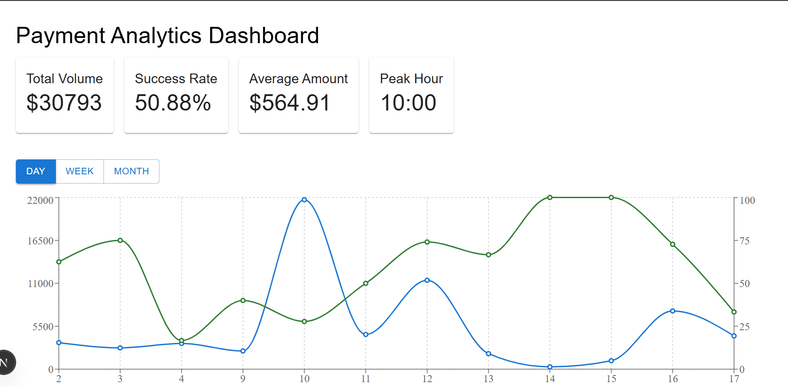
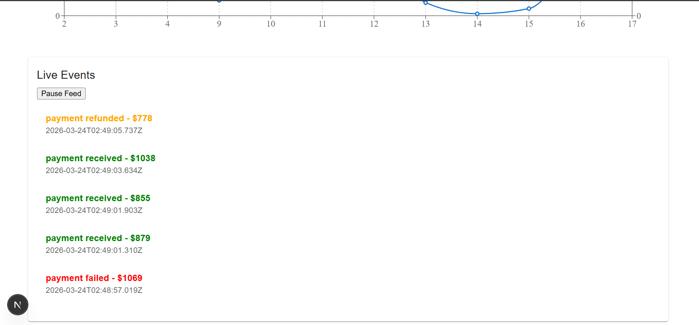

Real-Time Payment Analytics Dashboard

A full-stack real-time analytics dashboard for monitoring payment activity. The system processes live payment events, aggregates analytics metrics, and visualizes trends through an interactive dashboard.

Built using Next.js, NestJS, MongoDB, WebSockets, and Redux Toolkit in an Nx monorepo architecture.

## Features
Real-Time Payment Monitoring

WebSocket-based payment event streaming

Live event feed with pause/resume functionality

Instant UI updates without page refresh

Analytics Dashboard

Total payment volume

Payment success rate

Average transaction amount

Peak transaction hour

Top payment method

Interactive Data Visualization

Recharts-based analytics dashboard

Trend analysis with time filtering (Day / Week / Month)

CSV export of analytics data

Performance Optimizations

Redux Toolkit state management

RTK Query API caching

Memoized chart rendering

Efficient MongoDB aggregation queries

## Tech Stack
Frontend

Next.js (App Router)

Redux Toolkit

RTK Query

Material UI

Recharts

Socket.io Client

Backend

NestJS

MongoDB (Mongoose)

WebSocket Gateway

Socket.io

## Dev Architecture

Nx Monorepo

## Project Structure
financeops/
│
├── api/                 # NestJS backend
│   ├── modules/
│   │   ├── payments
│   │   ├── analytics
│   │   └── websocket
│   └── config
│
├── web/                 # Next.js frontend
│   ├── components/
│   │   └── dashboard
│   ├── store/
│   └── utils/
│
├── docker-compose.yml
├── ARCHITECTURE.md
├── .env.example
└── README.md

## System Architecture

The system follows a real-time event-driven architecture.

Frontend (Next.js + Redux)
          │
          │ REST API + WebSocket
          ▼
Backend (NestJS)
          │
          │ Aggregation Queries
          ▼
MongoDB

Payment events are stored in MongoDB and broadcast through WebSocket gateways, allowing the dashboard to update instantly.

Backend Modules
Payments Module

Handles payment creation and event broadcasting.

## Endpoint:

POST /api/payments/seed

Creates simulated payments for testing.

Analytics Module

Provides aggregated analytics data.

Endpoints:

GET /api/analytics/metrics
GET /api/analytics/trends?period=day|week|month

## Metrics include:

totalVolume

successRate

averageAmount

peakHour

topPaymentMethod

## WebSocket Gateway

Namespace:

/ws/payments

Broadcasts payment events in real time.

## Event format:

PaymentEvent {
  type: 'payment_received' | 'payment_failed' | 'payment_refunded'
  payment: Payment
  timestamp: Date
}
MongoDB Schema

Primary collection: payments

{
  tenantId: string
  amount: number
  method: string
  status: "success" | "failed" | "refunded"
  createdAt: Date
  updatedAt: Date
}

## Indexes are created on:

tenantId
createdAt
status
method

These indexes support efficient analytics queries.

Frontend State Management

Redux Toolkit manages application state.

## Global state structure:

{
  analyticsApi: RTK Query state
  events: {
    list: PaymentEvent[]
    paused: boolean
  }
  ui: {
    period: 'day' | 'week' | 'month'
  }
}

## Responsibilities:

Layer	Purpose
RTK Query	API data fetching and caching
Redux Slice	WebSocket event handling
UI Slice	Dashboard controls
Dashboard Components
MetricsGrid

Displays key analytics metrics using Material UI cards.

TrendChart

Visualizes payment trends using Recharts with dual-axis analytics.

EventsFeed

Displays real-time payment events streamed via WebSocket.

PeriodSelector

Allows switching analytics view between day, week, and month.

Running the Project
Install Dependencies
npm install
Start Backend
npx nx serve api

## Backend runs at:

http://localhost:3000
Start Frontend
npx nx dev web --port=3001

# Frontend runs at:

http://localhost:3001
Testing Real-Time Events

Generate simulated payment events:

curl -X POST http://localhost:3000/api/payments/seed

The dashboard updates instantly through WebSocket streaming.

CSV Export

Trend analytics can be exported directly from the dashboard as a CSV file for further analysis.

Docker Support

The project includes a docker-compose.yml configuration for containerized deployment.

Start all services with:

docker-compose up

## Services:

Service	Port
MongoDB	27017
Redis	6379
API	3000
Web	3001

## Scalability Considerations

The system can be extended with:

Redis caching for hot analytics endpoints

Redis Pub/Sub for WebSocket scaling

Multi-tenant organization isolation

Horizontal service scaling via containers

Future Improvements

Redis analytics caching

Multi-tenant authentication

Advanced anomaly detection

Kubernetes deployment

## Dashboard Preview

## Conclusion

This project demonstrates a real-time full-stack analytics system capable of processing live payment data and visualizing operational metrics.

## Key engineering concepts showcased:

real-time WebSocket event streaming

scalable analytics aggregation

modern React state management

modular backend architecture

The system is suitable for fintech monitoring dashboards and payment observability platforms.

## Author

Built as part of the FinanceOps Software Engineer Technical Assignment.

